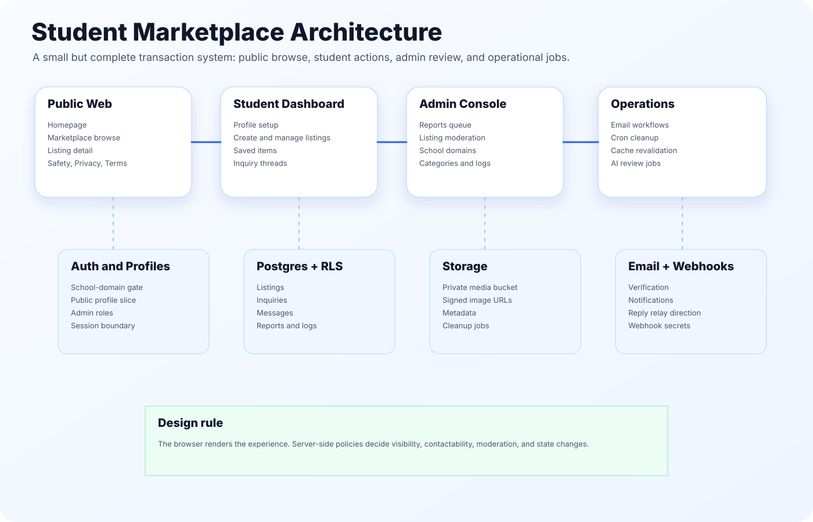
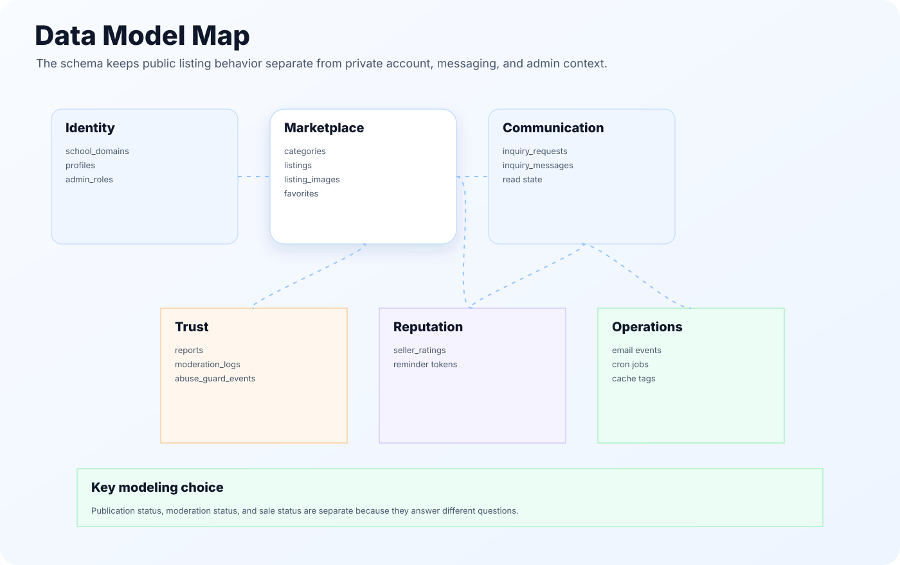
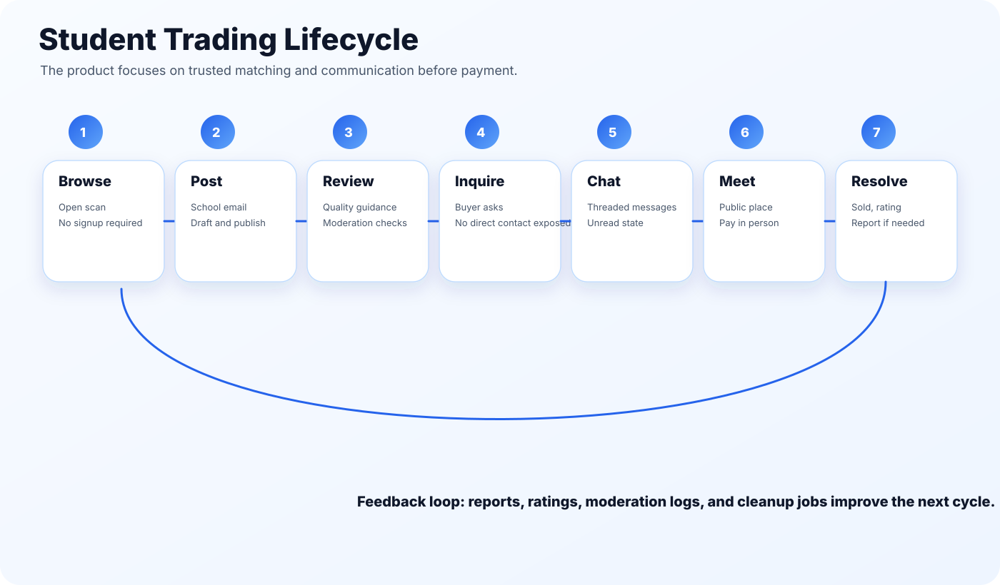
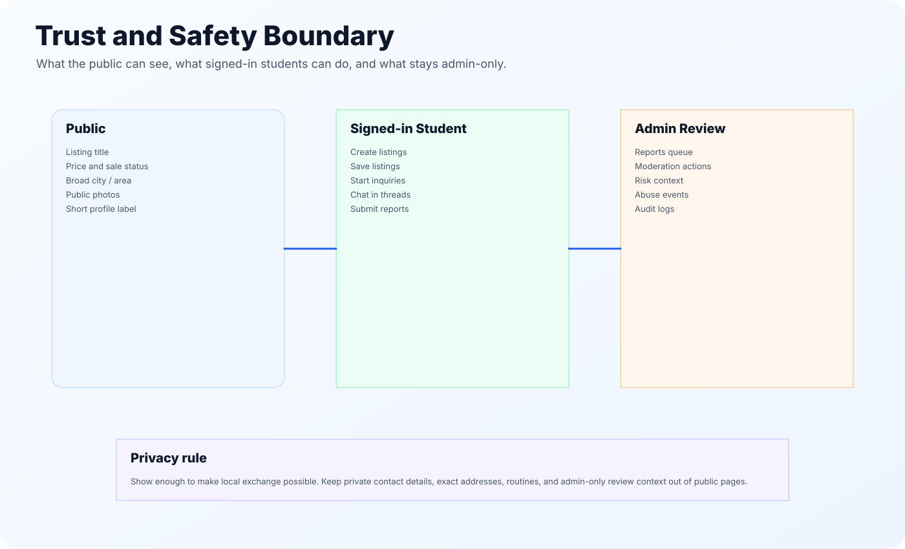
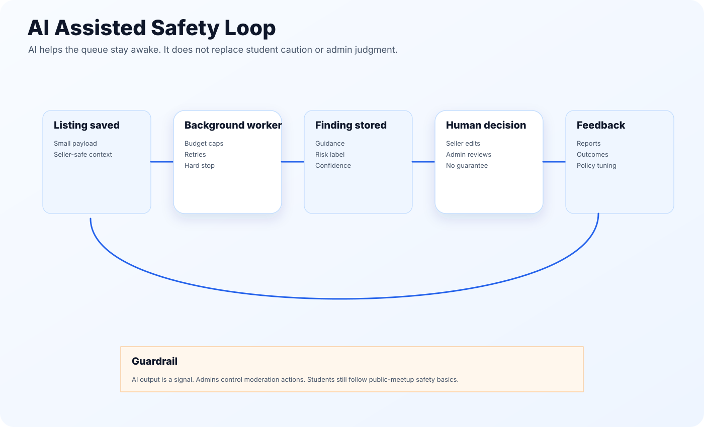
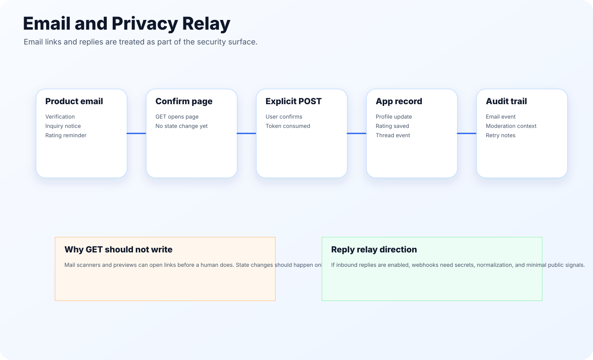

# Building a Trust-First Student Marketplace

## Abstract

Student marketplaces are easy to sketch and hard to run. A homepage, a grid of cards, and a sell button are not enough. Once students can post, message, and meet in person, the product needs rules: who can join, what can be shown publicly, when a listing can be contacted, how reports are handled, and how much automation is safe.

Student Help Student was designed around that reality. It is a local, school-email-gated marketplace for students in the Mississauga and Peel area. The project keeps the buyer experience simple while adding the backend structure needed for a real early-stage marketplace: access control, listing states, signed media, inquiry threads, report flows, email notifications, admin review, cache refreshes, scheduled cleanup, and AI-assisted review signals.

The main lesson is straightforward: a trustworthy student marketplace should start with matching, communication, and safety boundaries before it starts thinking about payments.

---

## 1. Product problem

Students often need small local transactions: textbooks, calculators, used electronics, sports gear, tutoring, study groups, and school-friendly services. General classifieds platforms can work, but they are not shaped around students. They usually push users into open public contact, wide geographic search, and generic safety advice.

This product narrows the scope:

- local student listings
- school-email access for posting and messaging
- browse-before-signup behavior
- broad meetup hints instead of exact addresses
- inquiry-first communication
- in-person exchange and payment
- report and moderation support

That narrow scope is a strength. It keeps the system small enough to ship while still solving the important trust problems.

---

## 2. Product principles

### Browse first

A student should be able to scan the marketplace before creating an account. Forced signup too early makes a local marketplace feel empty and heavy.

### School email unlocks action

Browsing stays public. Posting, saving, and messaging require a supported school email. This gives the platform a basic community boundary without pretending to perform full identity verification.

### Meet in public, pay in person

The first version does not handle payment. That is intentional. Payment introduces disputes, chargebacks, refunds, escrow, payouts, and regulated-money questions. For this stage, the right product is local matching plus clear meetup safety.

### Admins decide, AI assists

AI can help summarize, classify, and guide. It should not silently enforce, guarantee safety, or replace admin judgment.

---

## 3. Architecture

The application is split into three surfaces.

**Public surface** handles browsing, public listing pages, public safety pages, and low-friction product education.

**Student dashboard** handles profile setup, listing creation, saved items, inquiries, chat threads, sale status changes, and seller ratings.

**Admin surface** handles reports, moderation, school domains, categories, listing review, and operational checks.

The backend is shaped around server-side rules rather than UI-only decisions. That matters because marketplace safety rules should not depend on the browser behaving nicely.

---

## 4. Data model

The core model is small but not shallow:

| Area | Main concepts |
| --- | --- |
| Identity | school domains, profiles, admin roles |
| Marketplace | categories, listings, listing images, favorites |
| Communication | inquiry requests, inquiry messages, read state |
| Trust | reports, moderation logs, abuse guard events |
| Reputation | seller ratings, reminder tokens |
| Operations | email jobs, cron tasks, cache tags |

The most important modeling choice is to separate listing visibility from listing ownership. A seller can own a listing that is a draft, paused, under review, sold, or removed. Public users should only see the safe public slice.

---

## 5. Listing lifecycle

A simple marketplace card hides a lot of state. This project separates three state dimensions:

| State dimension | Examples | Why it exists |
| --- | --- | --- |
| Publication | draft, published, paused, archived | Seller intent |
| Moderation | normal, flagged, under review, removed | Safety and admin review |
| Sale | available, on hold, sold | Buyer-facing trade status |

This is cleaner than trying to store everything in a single `status` field. A listing can be published but under review, visible but on hold, archived but still kept for moderation records, or sold but still available for rating history.

---

## 6. Inquiry-first communication

The product does not need to expose direct contact details to enable a sale. A buyer sends an inquiry. If the listing is contactable, the system creates a thread and keeps the conversation inside the app.

This has several benefits:

- duplicate inquiries can be limited
- messages can carry unread state
- closed or declined threads can block new messages
- reports can reference the conversation context
- admin review can happen without asking users to forward screenshots
- private contact information stays off the listing page

The system is not trying to become a social network. It only needs enough messaging to support safe local handoff.

---

## 7. Trust and safety

The trust model is practical, not theatrical.

Good safety design here means:

- no exact addresses on listing cards
- no phone numbers or personal emails in public listings
- public meetups encouraged by default
- report flow available for listings, profiles, and messages
- admin moderation for serious cases
- email links that do not mutate state on scanner-triggered GET requests
- clear copy that avoids overpromising protection

The strongest decision is what the product does **not** say. It does not say payments are protected. It does not say the school endorses every user. It does not say AI can guarantee safety.

---

## 8. AI assisted operations

AI is useful in this product, but only if it stays in the right lane.

The best first uses are:

1. listing quality guidance for sellers
2. report triage for admins
3. safety signal summaries when a report or trigger path asks for context
4. queue prioritization when there are many cases

The system should avoid:

- hidden enforcement based only on model output
- public scores that stigmatize students
- scanning every private message as a product feature
- making emergency or legal decisions
- making safety guarantees

The right wording is: AI helps the platform notice, sort, and guide. People stay in control.

---

## 9. Email and privacy relay

Email is not just a notification channel. It is part of the safety surface.

Important decisions:

- verification links should use confirm-then-POST for state changes
- outbound emails should use product-owned sender domains
- inbound reply relay should require webhook authentication
- templates should avoid exposing raw provider errors
- notification settings should be explicit
- private email addresses should not become public marketplace contact details

This is the kind of detail that separates a real product from a static UI demo.

---

## 10. Performance and operations

The marketplace browse page is a hot path. It should not load the full dataset into the browser and filter locally. Server-side filters, pagination, and sorting keep the page fast and keep private data out of the client.

Operationally, the project benefits from:

- route revalidation after writes
- cache tags for listing, profile, marketplace, and inquiry paths
- daily cleanup for stale draft media
- rating reminder jobs
- targeted policy tests
- launch smoke checks for auth, email, public pages, and cron endpoints

The goal is not complex infrastructure. The goal is to avoid obvious failure modes after launch.

---

## 11. Portfolio value

This project shows full-stack judgment:

- product scope control
- practical data modeling
- privacy-aware communication
- server-driven marketplace browsing
- state-machine thinking
- trust and safety implementation
- admin workflow design
- lightweight AI governance
- operational readiness

It is a good technical showcase because the hardest parts are not flashy. They are the parts a real marketplace needs in order to survive normal use.

---

## 12. Future roadmap

The next valuable work is not immediate checkout. A better roadmap is:

1. stronger listing review tooling
2. better seller reputation summaries
3. safer media review and cleanup
4. richer admin case management
5. school-domain request workflow
6. marketplace quality metrics
7. optional payment exploration only after trust and dispute policies are mature

Payments can come later. Trust comes first.
