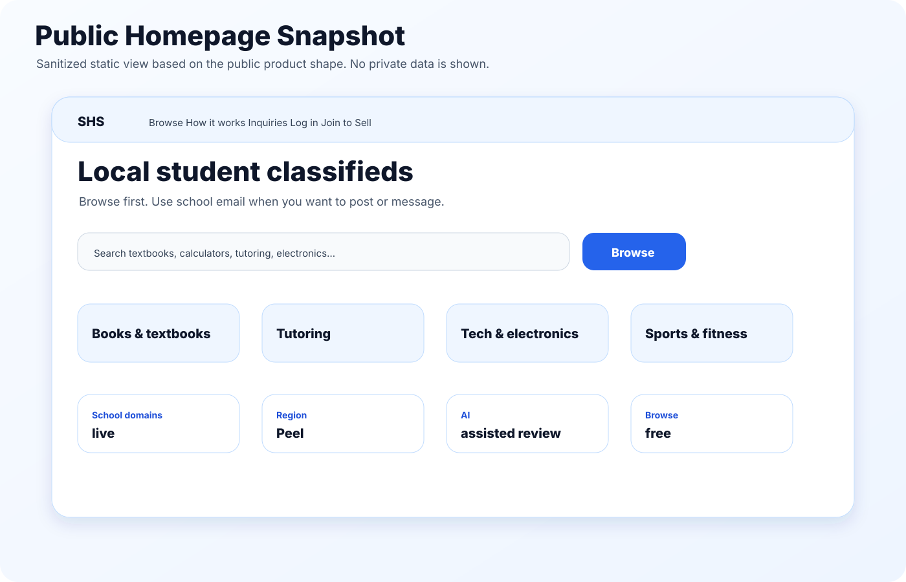
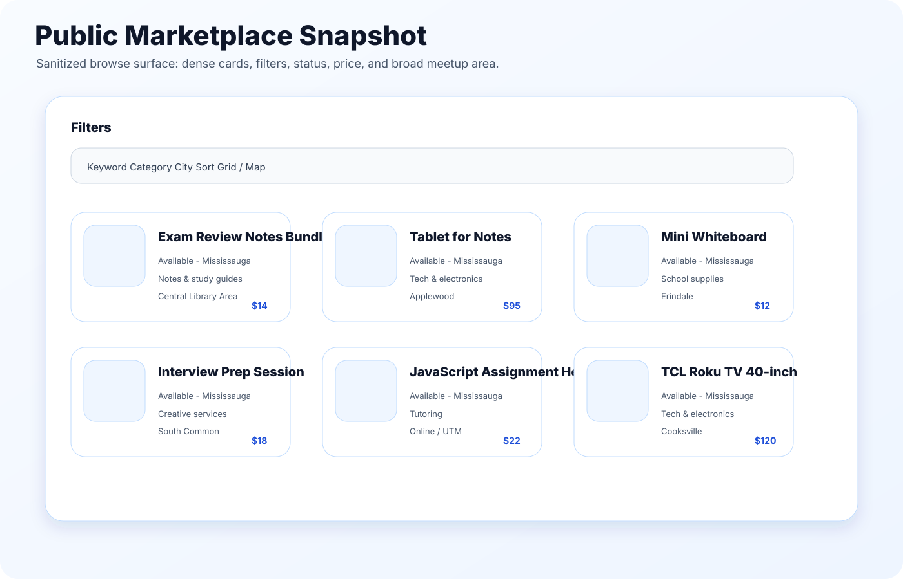
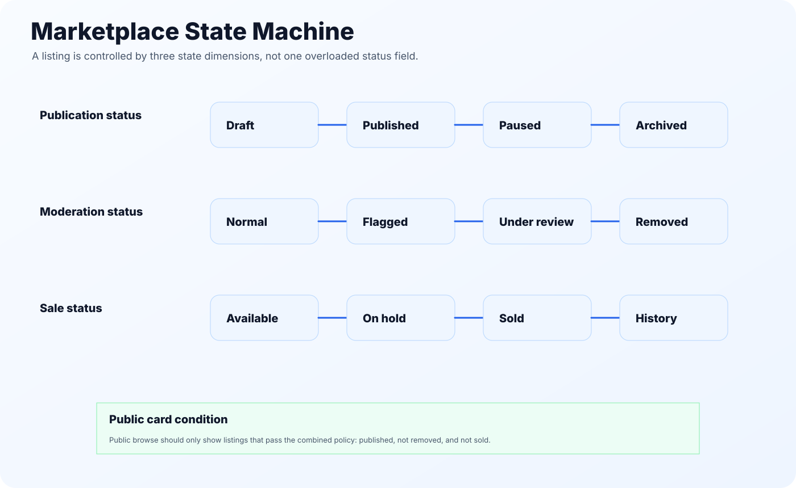

# Student Help Student - Technical Showcase

A technical case study for a school-gated student marketplace: local listings, student access control, inquiry-based messaging, trust and safety, lightweight AI assistance, and a clear path to operations.

This repository is written as a portfolio-ready technical sheet. It explains the product and engineering decisions without exposing production secrets, private account data, internal admin records, or environment variables.

**Live site:** <https://studenthelpstudent.ca/>  
**Implementation repository:** <https://github.com/Maxwellius-li/StudenthelpStudent> *(owner-managed; access may be restricted)*

---

## What this project is

Student Help Student is a local student marketplace for the Mississauga and Peel area. Anyone can browse. Students use a supported school email when they want to save listings, post, or message.

The product is intentionally simple on the surface:

- Browse first.
- Use school email when posting or messaging.
- Keep meetups public.
- Pay in person.
- Report anything that feels off.

Under the hood, the project is more than a marketplace UI. It has the shape of a small transaction system: access gates, listing state, image handling, inquiry threads, moderation, reporting, email workflows, cache invalidation, cron jobs, and admin review.

---

## Why this is a good portfolio project

Most marketplace demos stop at cards and filters. This one goes further. It deals with the parts that make a marketplace feel real:

1. **Who can participate** - school-domain access, profile creation, and public/private profile boundaries.
2. **What can be posted** - listing state, category rules, moderation status, and media handling.
3. **How buyers and sellers talk** - inquiry creation, thread messages, unread state, and workflow status.
4. **What happens when something goes wrong** - reports, admin triage, abuse guards, and safety copy.
5. **How the system stays maintainable** - migrations, server actions, cache tags, cron tasks, and testable policies.

It is also deliberately honest about scope. There is no checkout, escrow, payout, wallet, or buyer-protection claim. The first version focuses on trusted matching and communication before payment.

---

## System overview


| Layer | Implementation direction |
| --- | --- |
| Web app | Next.js App Router, React, TypeScript |
| UI | Tailwind CSS, shadcn/ui, Radix UI, lucide-react |
| Backend | Server Actions, Route Handlers, Server Components |
| Auth and data | Supabase Auth, Postgres, Row Level Security |
| Storage | Private listing media bucket with signed display paths |
| Email | Transactional email templates, verification links, inbound relay direction |
| Operations | Vercel deployment, route revalidation, cron jobs, cache tags |
| Quality | TypeScript checks, linting, targeted policy tests |

---

## Product flow


The main loop is intentionally short:

1. A student browses listings without needing an account.
2. A seller creates a draft listing with title, price, category, broad area, description, and images.
3. The listing becomes public only when publication, moderation, and sale states allow it.
4. A buyer sends an inquiry instead of receiving private contact details.
5. The conversation continues in an in-app thread.
6. The seller can mark the listing as available, on hold, or sold.
7. Reports and ratings feed the admin and trust layer.

---

## Visual index

| Figure | What it explains |
| --- | --- |
| [Architecture](assets/architecture.svg) | Public, dashboard, admin, database, storage, email, and jobs |
| [Trade lifecycle](assets/trade-lifecycle.svg) | From browse to listing, inquiry, chat, sale, report, and review |
| [Data model map](assets/data-model-map.svg) | Core tables and how they connect |
| [Trust boundary](assets/trust-safety-boundary.svg) | Public data vs signed-in data vs admin-only context |
| [Status machine](assets/marketplace-state-machine.svg) | Publication, moderation, and sale states |
| [Email privacy relay](assets/email-privacy-relay.svg) | Why email links and replies need guardrails |
| [AI assisted safety loop](assets/ai-assisted-safety-loop.svg) | AI as background guidance, not final authority |
| [Mobile browse loop](assets/mobile-browse-loop.svg) | Why browsing starts before signup |
| [Launch readiness scorecard](assets/launch-readiness-scorecard.svg) | What needs to be true before a student marketplace is trusted |
| [Public homepage snapshot](assets/public-homepage-snapshot.svg) | Sanitized public-facing view |
| [Public marketplace snapshot](assets/public-marketplace-snapshot.svg) | Sanitized listing browse view |

---

## Public product snapshots

These are sanitized, static visuals. They do not include private users, private messages, admin screens, cookies, environment values, or production database records.





---

## What I focused on

### 1. School-email access without overclaiming trust

The system uses supported school domains as a practical access gate. It does not pretend that email verification is the same as identity verification, school endorsement, or payment protection. The product copy stays careful: school email unlocks participation, while public meetups and normal caution still matter.

### 2. Listing state that can survive real use

A listing has more than one state. Public visibility depends on publication status, moderation status, and sale status. That keeps the buyer-facing model simple while still giving the backend enough room for drafts, pauses, removals, reports, and review.



### 3. Server-driven discovery

Marketplace browsing is built around query state: category, location, keyword, sort, pagination, and view mode. The important part is that the server owns the dataset slice. The browser does not need to download the full inventory and pretend to filter it locally.

### 4. Inquiry-first communication

Buyers do not need a seller's phone number or exact email to ask a question. They start with an inquiry, then continue in a thread. This gives the product a better safety surface: unread state, workflow status, report context, and admin review have a place to attach.

### 5. Trust and safety as product infrastructure

Safety is not just a page. It appears in data rules, write policies, report flows, public/private profile boundaries, email link handling, admin moderation, and abuse limits.


### 6. AI as an operations layer, not a magic judge

AI support is framed as quiet assistance: listing quality guidance, report triage, and chat safety signals. Students and admins remain in control. The system avoids claims that AI can guarantee safety.


---

## Source-code style examples

This techsheet includes small reference modules that show how the project thinks about policy logic. They are not copied from production source. They are clean, public-safe examples for portfolio review.

```bash
npm test
node src/demo.js
```

Included examples:

- `src/statusPolicy.js` - public visibility and contactability rules
- `src/listingQuality.js` - deterministic listing quality and safety review
- `src/inquiryPolicy.js` - buyer-to-seller contact checks
- `src/abuseGuard.js` - rate-limit and duplicate-submission helpers
- `src/answerSafetySummary.js` - review package builder for admin context
- `tests/run-tests.js` - small policy test suite

---

## Documentation map

- [Technical case study](PAPER.md)
- [Architecture notes](docs/architecture.md)
- [Marketplace lifecycle](docs/marketplace-lifecycle.md)
- [Data model](docs/data-model.md)
- [Trust and safety](docs/trust-and-safety.md)
- [AI assisted operations](docs/ai-assisted-operations.md)
- [Email and privacy relay](docs/email-and-privacy-relay.md)
- [Performance and operations](docs/performance-and-ops.md)
- [Product decisions](docs/product-decisions.md)
- [Launch and QA checklist](docs/launch-and-qa-checklist.md)
- [Portfolio notes](docs/portfolio-notes.md)
- [Public safety and privacy statement](docs/public-safety-and-privacy.md)
- [Source-code map](docs/source-code-map.md)
- [Roadmap](docs/roadmap.md)

---

## What is intentionally not included

This repository does not include:

- production environment variables
- API keys, tokens, webhook secrets, or database passwords
- real student emails or account records
- private chat transcripts
- admin-only production data
- private backend screenshots
- payment, escrow, wallet, or payout logic

This is a public technical showcase, not a dump of a production workspace.

---

## Portfolio summary

> Built a school-gated student marketplace for local listings, inquiries, and public meetups. I focused on the full pre-payment trading loop: school-domain access, listing publishing, server-side discovery, signed media, inquiry-based messaging, report handling, admin moderation, privacy-aware email workflows, cache revalidation, cron maintenance, and AI-assisted review signals with human oversight.
