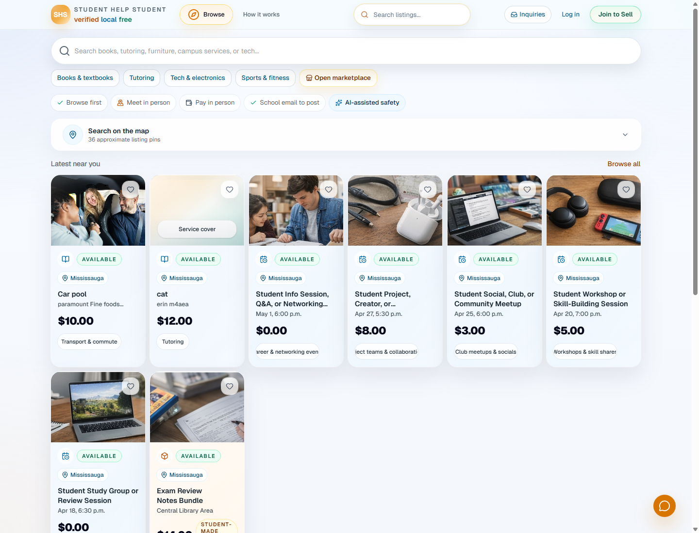
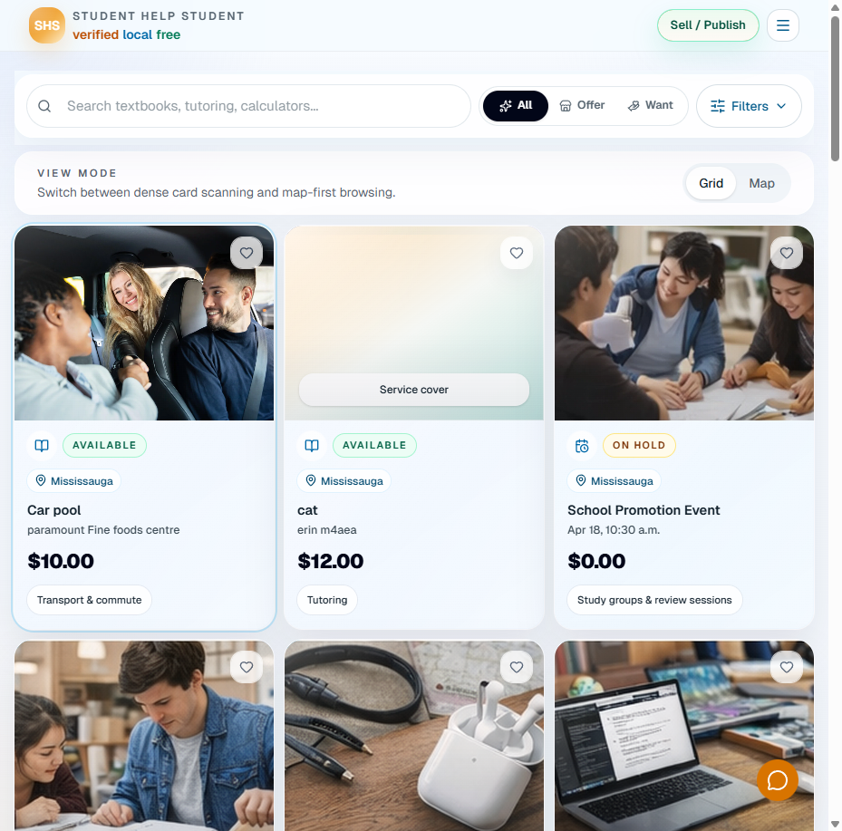

# Student Help Student 技术 Showcase

> 一个面向学生的 next-generation online trading marketplace：先解决“可信地发现、发布、沟通、审核”，再为后续支付和商业化留出边界。

[Live site](https://studenthelpstudent.ca/) · [Source repository](https://github.com/Maxwellius-li/StudenthelpStudent)

## 项目一句话

Student Help Student 是一个 Mississauga / Peel 地区学生 marketplace。它允许学生用学校邮箱注册，在同城范围内发布二手物品、服务和活动，买家可以浏览、收藏、发起 inquiry、进入站内聊天，卖家可以管理状态，管理员可以处理举报和审核。

这个项目不是一个普通 landing page，也不是只做前端 UI 的 demo。它更接近一个早期交易系统的产品骨架：身份门禁、商品发布、搜索发现、交易沟通、信任与安全、后台审核、邮件通知、图片存储、缓存失效和定时任务都已经连成闭环。

## 公开界面

## 系统架构

核心技术栈：

| Layer | Implementation |
| --- | --- |
| Web app | Next.js 16 App Router, React 19, TypeScript |
| UI | Tailwind CSS, shadcn/ui, Radix UI, lucide-react |
| Backend | Next.js Server Actions, Route Handlers, Server Components |
| Auth and DB | Supabase Auth, Postgres, Row Level Security |
| Storage | Supabase private bucket for listing images |
| Email | Brevo / SMTP workflows, Supabase Auth email templates |
| Ops | Vercel, Vercel Cron, cache tags, route revalidation |
| Quality | ESLint, TypeScript, targeted Node test suite |

## 交易流程

1. 学生先通过学校邮箱进入系统。注册流程会检查 email domain，并自动建立 profile。
2. 卖家在 dashboard 创建 listing，可以保存草稿、发布、暂停、归档，也可以上传多张图片。
3. 买家在 marketplace 浏览。筛选、排序和分页走服务端查询，不把全量数据扔给浏览器做假过滤。
4. 买家发起 inquiry。系统校验 listing 是否仍可联系、是否本人发布、是否需要等待冷却时间。
5. inquiry 会进入站内聊天。双方可以继续沟通，系统记录未读、最近消息和 workflow status。
6. 卖家可以把 listing 标记为 `Available`、`On hold`、`Sold`。成交后买家可以留下 seller rating。
7. 举报、审核、邮件通知、缓存刷新和 rating reminder 在后台补齐这个交易闭环。

## 我重点解决了什么

### 1. 学校邮箱门禁，而不是开放注册

项目用 `school_domains` 表和 Supabase Auth hook 做注册前置校验。用户登录后，系统会根据学校域名创建 profile，并保存学校快照。这样 marketplace 的信任基础不是“随便注册”，而是先把参与者限定在受支持的学生社区里。

相关实现：

- `src/lib/auth.ts`
- `src/app/actions/auth.ts`
- `supabase/migrations/202604060101_step2_foundation.sql`

### 2. Listing 引擎覆盖真实发布生命周期

listing 不是只有标题和价格。系统区分了三个状态维度：

| Status type | Purpose |
| --- | --- |
| publication status | 草稿、已发布、暂停、归档 |
| moderation status | 正常、被标记、审核中、移除 |
| sale status | 可交易、暂留、已售 |

这让用户看到的交易状态保持简单，同时后台仍然能做审核和风控。`Sold` 的商品不会继续作为可联系商品出现在发现逻辑里，`On hold` 会保留可见但降低误操作。

相关实现：

- `src/lib/listing-policy.ts`
- `src/app/actions/listings.ts`
- `src/components/listing-form.tsx`
- `src/components/quick-sale-status-form.tsx`

### 3. Marketplace 是服务端驱动的浏览面

公开 marketplace 不是一次性加载所有数据再在前端过滤。它用服务端查询处理 category、location、keyword、sort 和 pagination。图片来自 Supabase Storage，页面只给当前结果集生成 signed URL，避免把私有 bucket 直接暴露出去。

相关实现：

- `src/lib/live-data.ts`
- `src/app/(public)/marketplace/page.tsx`
- `src/components/marketplace-explorer.tsx`
- `src/components/listing-card.tsx`

### 4. Inquiry + Chat 形成交易沟通闭环

买家不是直接拿到卖家的私人联系方式，而是先发 inquiry。系统会检查：

- 用户是否已验证邮箱
- listing 是否公开、未售出、可联系
- 买家是否正在联系自己的 listing
- 是否存在短时间重复 inquiry

后续聊天记录存在 `inquiry_messages` 表里，配合 unread count、read mark、thread summary 和 workflow status。这样交易沟通在站内完成，也方便处理举报、提醒和后续评分。

相关实现：

- `src/app/actions/inquiries.ts`
- `src/lib/chat.ts`
- `src/app/api/chat/messages/route.ts`
- `src/app/api/chat/read/route.ts`
- `supabase/migrations/202604121030_step16_in_page_chat.sql`

### 5. Trust & Safety 不是文案，而是数据和权限

项目没有写“绝对安全”“平台担保”这类过度承诺。它把安全做成几个具体机制：

- Row Level Security：用户只能管理自己的 profile、listing、inquiry 和收藏。
- Public profile view：公开页只暴露展示需要的字段。
- Report flow：用户可以举报 listing、profile 或 inquiry。
- Admin moderation：管理员能处理 listings、reports、domains、categories 和 promotions。
- Abuse guard：对重复提交、可疑输入和 subject 做规范化与 hash，降低滥用。

相关实现：

- `supabase/migrations/20260405_phase1_mvp.sql`
- `src/app/actions/reports.ts`
- `src/app/actions/admin.ts`
- `src/lib/abuse-guard-core.ts`
- `src/lib/report-policy.ts`

### 6. Email privacy relay 和通知工作流

交易沟通不直接鼓励用户公开私人邮箱。项目加入了 secondary email verification、notification preference、inquiry email alias、Brevo inbound webhook 和模板化邮件工作流。邮件系统覆盖 inquiry 创建、状态更新、举报、学校支持请求、listing moderation 和 seller rating reminder。

相关实现：

- `src/lib/email/workflows.ts`
- `src/lib/email/templates.ts`
- `src/app/api/email/inbound/brevo/route.ts`
- `supabase/migrations/202604072325_step11b_email_privacy_relay.sql`

### 7. 缓存、重验证和运营任务

项目用 Next.js cache tags 和 `revalidatePath` 控制数据更新后的页面一致性。listing 发布、状态更新、审核、举报、收藏、评分、聊天都会更新对应 tag 或路径。

定时任务包括：

- media cleanup：清理过期 draft、archived、removed listing 关联的图片。
- rating reminders：在合适时间给买家发送评分提醒。

相关实现：

- `src/lib/cache-tags.ts`
- `src/app/api/cron/media-cleanup/route.ts`
- `src/app/api/cron/rating-reminders/route.ts`
- `vercel.json`

## 数据模型摘要

| Domain | Tables / Concepts |
| --- | --- |
| Identity | `school_domains`, `profiles`, `admin_roles`, secondary email tokens |
| Marketplace | `categories`, `listings`, `listing_images`, favorites |
| Trading communication | `inquiry_requests`, `inquiry_messages`, email aliases |
| Trust | `reports`, `moderation_logs`, `abuse_guard_events` |
| Reputation | `seller_ratings`, rating reminder tokens |
| Monetization-ready layer | `promotions_catalog`, `promotion_purchases` |

## 产品边界

当前版本刻意不包含：

- payment checkout
- escrow
- seller payout
- platform commission
- wallet or balance system

原因很简单：学生 marketplace 的第一阶段风险不在“怎么收钱”，而在“谁能进来、发布的东西怎么被发现、买卖双方怎么联系、问题怎么被处理”。所以这个版本优先完成可信交易前的基础设施。

## 可展示的技术能力

这个项目能直接证明的能力：

- 能把模糊产品需求拆成身份、交易、审核、通知、运营任务几个可落地模块。
- 能在 Next.js App Router 中组织 public、dashboard、admin 三种访问面。
- 能设计 Supabase schema、RLS policy、索引、触发器和 migration 演进。
- 能处理真实 marketplace 的状态复杂度，而不是只做静态卡片。
- 能把隐私、安全、举报、审核做进系统，而不是只写在页面文案里。
- 能用缓存标签、路径重验证和 cron job 处理上线后的数据一致性与维护任务。
- 能保持产品边界清晰，知道哪些功能现在该做，哪些应该留到下一阶段。

## Portfolio 版本简介

如果放进个人 portfolio，可以直接使用下面这段：

> Built Student Help Student, a school-gated student trading marketplace for the Mississauga / Peel area. The system uses Next.js App Router, Supabase Auth/Postgres/Storage, RLS, server actions, signed listing media, inquiry-based messaging, moderation workflows, email notifications, cache revalidation, and scheduled maintenance jobs. I focused on the full trading lifecycle before payment: verified access, listing discovery, buyer-seller communication, safety reporting, admin review, seller reputation, and privacy-aware email handling.

## 隐私说明

这份 showcase 只使用公开网站截图、公开 GitHub 源码结构和抽象化架构说明。没有包含任何私有邮箱、账号、cookie、环境变量、API key、后台用户、真实交易双方信息或生产数据库内容。
